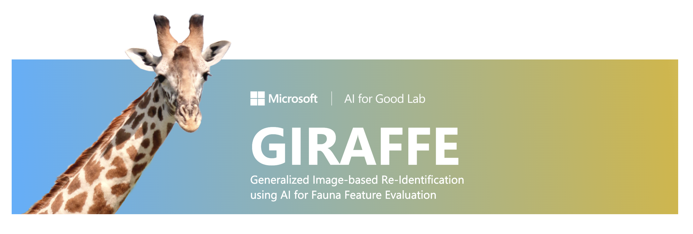
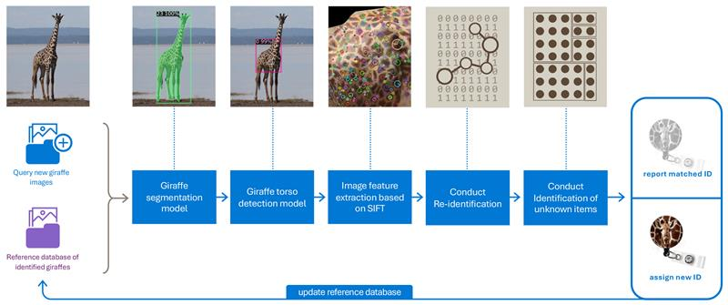
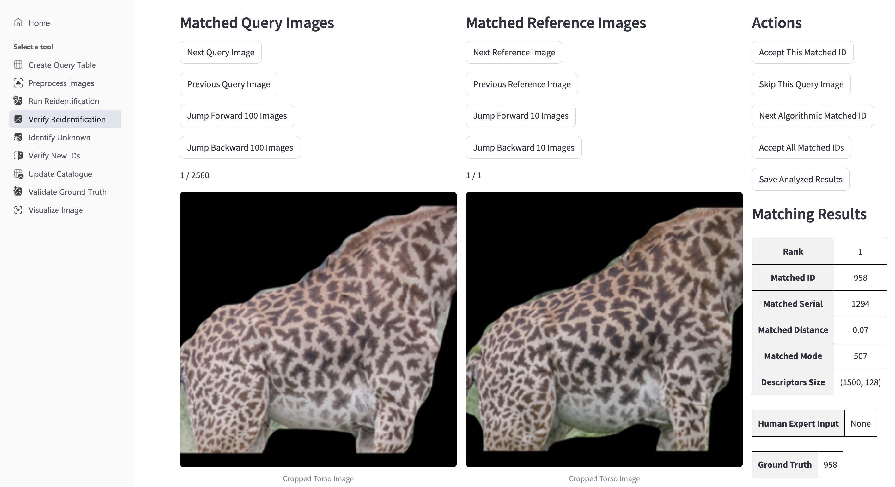
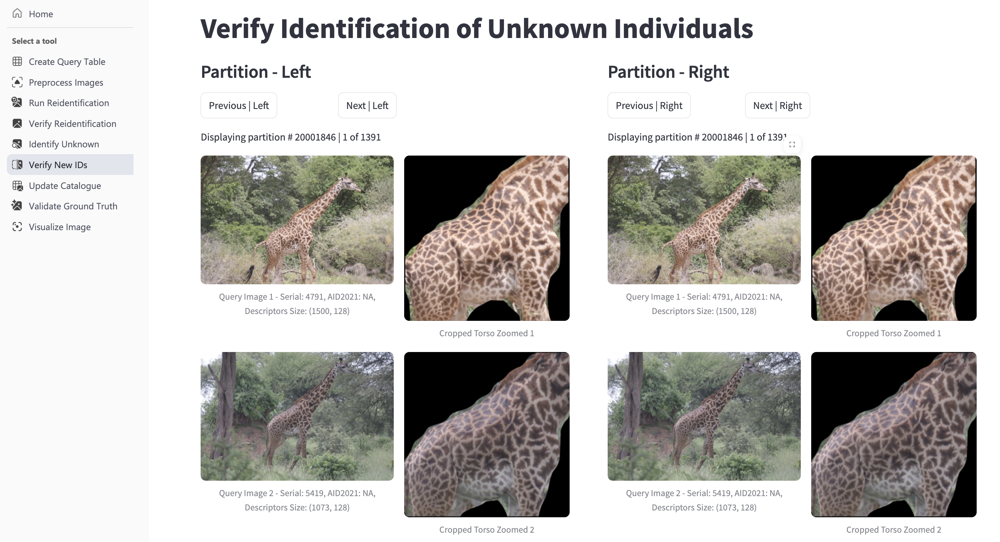

    

# **Table of Contents**
- [**Table of Contents**](#table-of-contents)
- [GIRAFFE: AI-Powered Giraffe Re-Identification for Conservation](#giraffe-ai-powered-giraffe-re-identification-for-conservation)
  - [**Key Features**](#key-features)
  - [**Why It Matters**](#why-it-matters)
  - [**Partnership**](#partnership)
  - [**Overview**](#overview)
  - [**System Components**](#system-components)
    - [**Image Preprocessing and Representations**](#image-preprocessing-and-representations)
    - [**Vector Similarity Search**](#vector-similarity-search)
    - [**User Interface**](#user-interface)
      - [**1. Review Re-identified Known Individuals**](#1-review-re-identified-known-individuals)
      - [**2. Review Unknown Individuals**](#2-review-unknown-individuals)
      - [**3. Review Partitioning of Unknown Individuals**](#3-review-partitioning-of-unknown-individuals)
  - [**Performance Evaluation and Benchmarking**](#performance-evaluation-and-benchmarking)
    - [**Accuracy: Re-identification of Known Items**](#accuracy-re-identification-of-known-items)
    - [**Accuracy: Partitioning Algorithm for Unknown Items**](#accuracy-partitioning-algorithm-for-unknown-items)
    - [**Runtime**](#runtime)
  - [**Usage**](#usage)
  - [**Contributing**](#contributing)
  - [**Citing**](#citing)
  - [**Licensing**](#licensing)

# GIRAFFE: AI-Powered Giraffe Re-Identification for Conservation  

Accurate and scalable wildlife re-identification is essential for biodiversity monitoring and conservation efforts. **GIRAFFE** (Generalized Image-based Re-Identification using AI for Fauna Feature Extraction) is an advanced AI-driven system designed to automate the identification of individual giraffes, with potential applications for other species.  

## **Key Features**  
- **AI-Powered Identification**: Leverages local feature matching for high-accuracy individual recognition.  
- **Scalability**: Efficiently processes large datasets containing thousands of images.  
- **User-Friendly Interface**: Accessible to both technical and non-technical users.  
- **Automated Catalog Updates**: Reduces manual effort required for validating matches.  
- **Support for Conservation**: Aids in tracking endangered species and studying population dynamics.  

## **Why It Matters**  
Traditional re-identification methods require extensive manual work, making large-scale biodiversity studies time-consuming and error-prone. **GIRAFFE** automates key steps, enabling conservationists and researchers to efficiently curate datasets, analyze migration patterns, and develop data-driven conservation strategies—all while maintaining accuracy and interpretability.  

By streamlining population tracking, **GIRAFFE** enhances conservation efforts and supports biodiversity research, contributing to the long-term protection of giraffe populations in the wild.

    
    
Software Demo

## **Partnership**
This project was developed at the Microsoft AI for Good Lab in collaboration with Derek E. Lee, Ph.D., a quantitative ecologist, population biologist, and the Principal Scientist at the Wild Nature Institute to support [Masai Giraffe Conservation Project](https://www.wildnatureinstitute.org/giraffe.html).

## **Overview**  

We present a unified AI-driven framework for accurate and efficient wildlife re-identification. The system integrates deep learning-based computer vision models for image preprocessing, vector indexing and search libraries for scalable retrieval, and advanced matching algorithms within an interactive user interface. This design enables large-scale visualization, expert-in-the-loop validation, and iterative refinement.  

The AI pipeline supports end-to-end management of a matching project and consists of the following components:  

1. **Computer Vision Models for Image Preprocessing**: Perform giraffe segmentation and torso detection to remove unnecessary background noise.  
2. **Image Descriptor Creation**: Generate key points and descriptors for each preprocessed giraffe image.  
3. **Re-identification Matching Algorithm**: Compare preprocessed image descriptors against a reference dataset of previously identified giraffes to recognize known individuals.  
4. **Unknown Items Partitioning Algorithm**: Cluster unidentified giraffe images by comparing them against each other, ensuring unique labeling of new individuals.  
5. **Human Expert Validation and Intervention**: Enable expert review and refinement of AI-generated results when needed.  
6. **Reference Dataset Update**: Automatically update the reference dataset with new matching results, improving future re-identifications.  

Key contributions of our system include leveraging mode statistics to optimize matching criteria, implementing a distributed indexing and sharding strategy for robust retrieval, and integrating vector search libraries for efficient nearest-neighbor queries. Through extensive parameter optimization, the system consistently achieves over **90% accuracy across seven standard machine learning metrics**, with **re-identification accuracy reaching 99%**. Each query is processed in under two seconds, even against a catalog containing thousands of images.  

Evaluated on the Masai giraffe dataset, our approach enhances reliability by combining automated processing with expert oversight, enabling **accurate individual tracking and long-term conservation efforts**.  

    
    
AI Workflow Visualization

While technical users can run individual scripts separately, we provide a **comprehensive User Interface (UI)** to make the solution accessible for non-technical users. The UI allows users to interact with each module independently, visualize matching results, and validate and refine outputs before updating the database. It simplifies execution by running scripts via button clicks within a **tmux session**, ensuring seamless logging for both standard and error outputs. Non-technical users can operate the system **without needing to interact with the terminal**. This interface effectively functions as a **batch query management tool**, streamlining the processing of giraffe photos after each survey and data collection phase to support biodiversity research on **population trends and survival rates**.  

The **computer vision model** focuses on detecting the giraffe’s torso, minimizing background interference to enhance accuracy. Processed results are saved, creating a **reusable pool of image descriptors** for future identification tasks. Currently, we use **SIFT (Scale-Invariant Feature Transform)** to generate key points and descriptors for the matching algorithm, but the pipeline is designed to be adaptable to other feature extraction methods. To enable **efficient retrieval at scale**, we integrate **FAISS (Facebook AI Similarity Search)** allowing for fast nearest-neighbor searches in both re-identification and partitioning algorithms.

## **System Components**
### **Image Preprocessing and Representations**  

Our system employs advanced computer vision algorithms for data preprocessing, ensuring high-quality inputs for the matching pipeline. The preprocessing consists of three key stages:  

1. **Giraffe Segmentation**:  
   In the first stage, we use a pretrained [Detectron2 instance segmentation model](https://github.com/facebookresearch/detectron2/blob/main/configs/COCO-InstanceSegmentation/mask_rcnn_R_50_FPN_3x.yaml) to segment giraffes from images. This model isolates the **central giraffe**, removing background distractions and improving feature extraction.  

2. **Giraffe Torso Detection**:  
   In the second stage, we use a **fine-tuned model** based on a pretrained [Detectron2 object detection model](https://github.com/facebookresearch/detectron2/blob/main/configs/COCO-Detection/faster_rcnn_R_101_FPN_3x.yaml) to detect giraffe torsos. We created a specialized torso annotation dataset for fine-tuning by aligning cropped giraffe torso images from previous projects with the Wild Nature Institute’s dataset. The intersection of the segmentation model and our customized torso detection model, included in this repository, ensures accurate and consistent giraffe torso detection and segmentation, enhancing the reliability of the re-identification process.   

3. **Reference Catalog Creation**:  
   To enable efficient matching, we construct a **reference dataset** containing annotated images of individual giraffes, focusing exclusively on **torso-only images** with backgrounds removed. Each new query image is compared against this dataset using SIFT, which extracts key points and descriptors for feature matching. If a match is found, the system assigns the corresponding ID; otherwise, a new ID can be generated, and the reference dataset is updated accordingly.

    
    
Image Preprocessing Example

### **Vector Similarity Search**  
We use the FAISS library for efficient similarity search and image descriptor retrieval. Training the FAISS index using `IndexHNSWFlat` on a reference dataset of approximately **26,000 images** containing approximately **37 million** descriptor vectors takes around **11 minutes**. Keep this overhead in mind when planning your workflow. To enhance accuracy and robustness, we employ a **distributed indexing and merging approach**, ensuring efficient and reliable similarity search across large-scale datasets.  

### **User Interface**  

The user interface (UI) is designed as a **multi-functional tool** that simplifies batch image processing and large-scale visualization. To ensure seamless collaboration between AI automation and expert oversight, the UI provides **three key visualization checkpoints** following the initial image matching process:

#### **1. Review Re-identified Known Individuals**  
This checkpoint allows experts to verify AI-generated matches by comparing each query image with its corresponding reference images. The interface displays preprocessed query images alongside potentially multiple reference images of the same giraffe, ensuring contextual clarity. Key functionalities include:
- **Navigation through multiple reference images** to verify matches.
- **Reviewing the top three AI-recommended matches** with detailed results displayed in a table.
- **Accepting AI-generated matches** for individual queries or in bulk if no expert review is required.
- **Skipping low-quality images** to streamline validation.
- **Rejecting incorrect matches** to refine the database and improve accuracy.

#### **2. Review Unknown Individuals**  
For cases where no matches were found in the reference dataset, this checkpoint allows experts to review and assign new IDs. The UI presents both the preprocessed image alongside the rejected matched item side by side, providing multiple action options: 
- **Reversing a rejected match** by accepting an AI-suggested image (useful if the cutoff threshold was too strict).  
- **Assigning a new ID** to an individual when no match is found.  
- **Skipping low-quality images** to maintain dataset quality.  
- **Auto-labeling all unmatched individuals** for efficient batch processing if no expert review is required.  

#### **3. Review Partitioning of Unknown Individuals**  
After unknown individuals have been identified, the partitioning algorithm clusters similar individuals together. This checkpoint enables experts to:  
- **Compare clustered image groups side by side** to validate partitioning accuracy.  
- **Ensure distinct groups represent unique individuals** before assigning labels.

    
    
User Interface Tab: Re-identification Verification

    
    
User Interface Tab: New Identifications Verification

## **Performance Evaluation and Benchmarking**
### **Accuracy: Re-identification of Known Items**
In the giraffe re-identification task, we classify existing giraffes in the query input batch as positive items and new giraffes as negative items. To evaluate re-identification accuracy, we compute standard binary classification metrics. Additionally, for the subset of query data with re-identified labels, we report accuracy in the table below. The results for several data splits on Wild Nature Institute's Masai giraffes are shown below.

| Case                         | Data Split 1 | Data Split 2 | Data Split 3 |
|------------------------------|-------------|-------------|-------------|
| **Reference catalog**        | 20,687      | 15,965      | 7,000       |
| **Query set**                | 4,666       | 4,666       | 4,666       |
| **Unknown items in query set** | 1,470      | 1,505       | 1,990       |
| **Known items in query set**  | 3,196       | 3,161       | 2,676       |
| **Sharding**                 | No / Yes    | No / Yes    | No          |
| **Overall accuracy**         | 95% / 95%   | 94% / 95%   | 95%         |
| **Accuracy (re-identified items)** | 99% / 99% | 99% / 99% | 100%       |
| **Recall (known)**           | 0.94 / 0.95 | 0.93 / 0.95 | 0.93        |
| **Precision (known)**        | 0.98 / 0.97 | 0.98 / 0.97 | 0.98        |
| **F1 score (known)**         | 0.96 / 0.96 | 0.96 / 0.96 | 0.95        |
| **Recall (unknown)**         | 0.95 / 0.93 | 0.97 / 0.93 | 0.98        |
| **Precision (unknown)**      | 0.88 / 0.90 | 0.87 / 0.90 | 0.91        |
| **F1 score (unknown)**       | 0.92 / 0.92 | 0.92 / 0.92 | 0.94        |

### **Accuracy: Partitioning Algorithm for Unknown Items**
To assess the partitioning accuracy of new, unknown giraffes, we use the Adjusted Rand Index. The results for several data splits on Wild Nature Institute's Masai giraffes are shown below.

| Case                                                        | Data Split 1 | Data Split 2 | Data Split 3 |
|-------------------------------------------------------------|--------------|--------------|--------------|
| **Reference catalog (used for initialization option)**      | 7,000        | 7,000        | 7,000        |
| **Detected as unknown items in query set (used in partitioning)** | 1,586  | 1,742        | 2,146        |
| **Index initialization**                                    | No / Yes     | No / Yes     | No / Yes     |
| **Adjusted Rand Index (partitioning)**                      | 0.82 / 0.98  | 0.81 / 0.98  | 0.83 / 0.98  |

### **Runtime**
On a Standard NC6s v3 Azure Linux machine (6 vCPUs, 112 GiB RAM) powered by NVIDIA Tesla V100 GPU, the expected runtime for each step is shown below. Training FAISS index on reference dataset of 25,363 images takes ~11 mins.

| Process in Workflow                                              | Time per Query Image (Seconds) |
|-----------------------------------------------------------------|-------------------------------|
| **Preprocess and save image using segmentation and object detection models** | 1.7                           |
| **Generate image key points and descriptors using SIFT**   | 0.13                          |
| **Conduct query matching for re-identification using trained index** | 0.03                          |
| **Conduct partitioning for unknown items by training a new index** | 0.07                          |
| **Update database with existing items**                   | 0.0075                        |

Total compute time for processing and matching a sample dataset provided by Wild Nature Institute is:
- **Reference dataset (~26,000 images)**: 13 hours
- **Query dataset (~15,000 images)**: 8 hours

## **Usage**
Check out our documentation [here](./docs/README_docs.md).

## **Contributing**
This project is open to your ideas and contributions. We have adopted the [Microsoft Open Source Code of Conduct](https://opensource.microsoft.com/codeofconduct/). For more information see the [Code of Conduct FAQ](https://opensource.microsoft.com/codeofconduct/faq/) or contact [us](sgholami@microsoft.com) with any additional questions or comments.

## **Citing**
You can cite our software by using the "Cite this repository" button on the right side of this GitHub repository. This automatically provides citation details based on our `CITATION.cff` file.

## **Licensing**  
   
This project is licensed under the MIT License. See the LICENSE file for more details.  