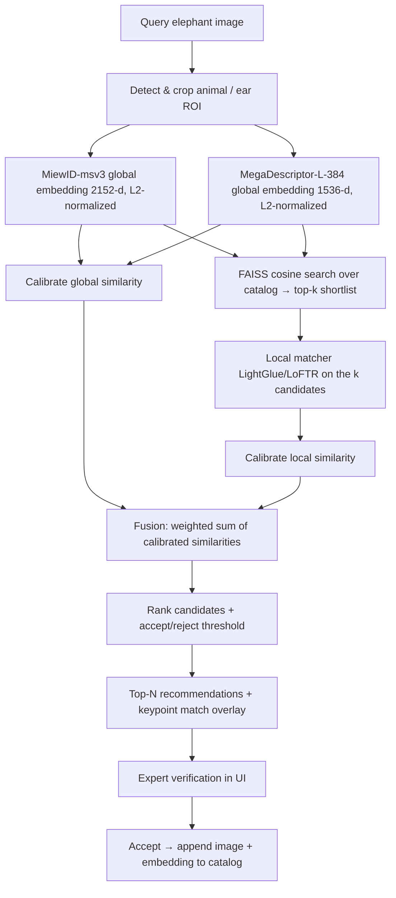

# Elephant Re-Identification — Adaptation Plan

> **Governance note:** This work targets **poaching-sensitive** data (elephant GPS
> coordinates) and a **private** Azure environment (Ganesha). The current Git remote
> is the **public** repo `github.com/microsoft/giraffe-identification-ai-tool`.
> **Do not push elephant code, data, or config to that remote.** See
> [Repository strategy](#1-repository-strategy-fork-vs-branch) below.

## 0. Goal

Adapt the GIRAFFE re-identification framework to identify individual **elephants**
for the Kariega project, replacing the giraffe-specific
`detectron2 torso crop → SIFT → FAISS mode-voting` pipeline with a **WildFusion-style
hybrid matcher**: a calibrated fusion of a **global deep descriptor** (MiewID-msv3
and/or MegaDescriptor-L-384) and a **local feature matcher** (LightGlue / LoFTR).

Rationale: elephants are identified by ear notches/tears/holes, venation, tusks and
body shape — not a high-contrast coat pattern — so classical SIFT on a torso crop is
weak. A hybrid global+local matcher is the current state of the art for this regime
and beats a single global descriptor (e.g. MegaDescriptor) alone.

---

## 1. Repository strategy (fork vs branch)

**Recommendation: a separate _private_ repository, with feature branches inside it.
Do not branch on the public giraffe repo.**

| Factor | Implication |
| --- | --- |
| Current remote is **public** `microsoft/giraffe-identification-ai-tool` | A branch still pushes to a public remote → would expose elephant config, Cosmos/Blob identifiers and GPS-bearing artifacts. Disqualifying. |
| Data is **poaching-sensitive** (lat/lon) | Needs stricter access control than an open-source repo can offer. |
| Model stack **diverges** (torch 2.x, MiewID, LightGlue/LoFTR; drop SIFT + detectron2) | Cleaner to evolve independently than to gate every change behind giraffe compatibility. |
| Repo is explicitly "Generalized" (multi-species intent) | Keep a clean species-agnostic **core** so shared improvements can be upstreamed later, or extracted into a shared library. |

Concretely:
1. Create a new private repo, e.g. `ganesha-elephant-reid` (Ganesha sub / internal ADO),
   seeded from this codebase as the starting point.
2. Do active work on feature branches there (e.g. `feat/miewid-extractor`,
   `feat/wildfusion-matcher`), merging to that repo's `main`.
3. Keep the species-specific bits (models, configs, UI copy) separable from the
   re-ID **core** so a future refactor can expose a shared `reid-core` library used
   by both giraffe and elephant projects.
4. Generic, non-sensitive improvements (bug fixes, framework refactors) can be
   contributed back to the public giraffe repo as normal PRs.

> Fork vs. fresh private repo: a **private fork** preserves history and makes
> upstreaming easy; a **fresh private repo** gives the cleanest break. Given the stack
> divergence and data sensitivity, a fresh private repo seeded from this code (or a
> private mirror) is the safer default. Either way: **private**, not a branch on the
> public repo.

---

## 2. Target architecture (WildFusion hybrid)



Why this design:
- **Global descriptors (MiewID + MegaDescriptor)** are fast and scalable → use them to
  shortlist top-k from the whole catalog via FAISS (cheap, one vector per image). Two
  independent global descriptors provide a broader shortlist union and a richer fusion signal.
- **Local matcher (LightGlue/LoFTR)** is accurate but expensive (pairwise) → run it
  only on the k shortlisted candidates.
- **Calibration** maps each matcher's raw scores onto a common [0,1] scale (isotonic /
  temperature scaling) so they can be **fused** meaningfully; fusion is a weighted sum/mean.
- This is exactly the WildFusion recipe and is what makes the hybrid beat a single
  global descriptor.

Implementation path: prefer the **`wildlife-tools`** library (provides MiegaDescriptor +
MiewID extractors, LoFTR/LightGlue matchers, calibration, and the fusion logic) over
re-implementing from scratch. Fall back to `pymiew` + `kornia` + `lightglue` directly if
a dependency pin forces it (see Phase 0).

---

## 3. Data strategy

**Rebuild embeddings from the local images** with a pinned MiewID-msv3; treat the
Cosmos vectors as throwaway. (Decision already made — recap of why:)
- Cosmos stores embeddings **per individual, not per image** → no vector↔photo link,
  which breaks global+local fusion.
- Provenance is **unverified** ("consistent with MiewID-msv3") → can't guarantee
  query embeddings land in the same space.
- We need a controlled extractor for query-time anyway → recomputing the ~620 catalog
  images is then essentially free (8× V100 available).

Keep from Cosmos / the inventory: **labels & metadata** (individual name, `seek_id`,
herd, sex/age, markings, GPS) — valuable and not reproducible.

Catalog scope (from `data/elephant_image_embedding_inventory.xlsx`):
- **34 named individuals** have local images (the usable reference set).
- 17 individuals are embedding-only (0 images) → not usable in a hybrid; to cover them,
  pull their **images** from blob, not their vectors.
- 310 unlabeled / 126 unmatched images → query / unknown-individual pool.

Sanity check to run once: cosine-compare a few **recomputed** MiewID vectors against the
stored Cosmos vectors for the same individual; high agreement confirms msv3 provenance,
low agreement confirms the "unverified" warning — either way we proceed with recomputed.

---

## 4. Component change map (this codebase)

| Area | Today (giraffe) | Change for elephant |
| --- | --- | --- |
| `configs/config_vision.py` | detectron2 segmentation + torso-detection model paths | Elephant detector (MegaDetector / new) **or** whole-image pass-through; drop torso model |
| `configs/config_matching.py` | SIFT params, `faiss_distance_cutoff`, `gt_keyname_col='AID2021'`, `#Serial` | MiewID + MegaDescriptor config (HF ids, dims), matcher + shortlist `k`, fusion weights, calibration path; **cosine** thresholds; generalize key cols to `individual_id` / per-image `image_id` |
| `configs/config_elephant.py` (NEW) | — | Species profile: ID cols, model ids, `NEW_ID_PREFIX`, `ACTIVE_DESCRIPTORS`, viewpoint tag name |
| `pipeline/step_1_*crop_torso.py` | detectron2 torso/segmentation crop | Elephant ROI crop (MegaDetector bbox) or pass-through; emit `viewpoint` tag alongside crop; generalize `ProcessGiraffe` |
| `pipeline/step_2_create_image_discriptors.py` | `cv2.SIFT_create` per image → pickle of variable-length arrays | MiewID-msv3 + MegaDescriptor per-image embeddings (float32, L2-norm) → `.npy` matrix + parquet index keyed by `image_id` + `individual_id` + `viewpoint` |
| `pipeline/step_3_run_initial_matching.py` | FAISS HNSW + nearest-neighbor **mode voting** | FAISS cosine shortlist → LightGlue/LoFTR re-rank → calibrate + fuse → ranked recommendations |
| `pipeline/step_4_partition_new_items.py` | cluster unknowns on SIFT match counts | same clustering on **fused** similarity |
| `pipeline/step_5_evaluate_matching_results.py` | accuracy vs GT | add mAP, top-1/top-5, calibration (ECE); **same-view vs cross-view accuracy breakdown**; ablation harness |
| `pipeline/step_6_update_database.py` | append SIFT descriptors to ref dict | append per-image MiewID + MegaDescriptor embeddings (+ image) to catalog; write back labels and viewpoint |
| `utils/utils_matching.py` | `train_faiss` (HNSWFlat), reshape for thousands of SIFT vecs | one vector/image per descriptor; add local-matcher wrapper + calibration + fusion (or wildlife-tools) |
| `utils/helpers_matching.py` | `get_new_label_Id` int max+1 on `AID2021`/`#Serial` | generalize new-individual ID scheme for string `eleph_*` IDs; viewpoint-aware split helpers |
| `st_pages/*` | giraffe copy, torso/SIFT visuals | elephant rebrand; **keypoint match overlay** on verify pages (st_4, st_6); new metadata schema including `viewpoint` |
| Azure | blob mount via `mount_blob_gen2.sh` | + `azure-cosmos` (metadata, read-only), `azure-storage-blob` sync; Entra ID auth, Ganesha tenant |

---

## 5. Dependency / environment modernization

> **Resolve dependencies before writing code (Phase 0).** The torch 2.x + wildlife-tools +
> kornia + lightglue stack has non-trivial transitive constraints. Confirm the full install
> resolves and runs on the actual V100 box before committing to any library interface.
> Estimate: 20 minutes. If it doesn't resolve cleanly, fall back to `pymiew` + `kornia` +
> `lightglue` directly and skip `wildlife-tools` as a top-level dependency.

- **torch ≥ 2.x** (upstream already has a `dependabot/pip/torch-2.8.0` branch) + matching
  torchvision. Required by MiewID / kornia / lightglue.
- Add: `timm`, `huggingface_hub` (MiewID-msv3 backbone), `wildlife-tools`, `kornia`,
  `lightglue` (or kornia's LoFTR/LightGlue), `faiss-gpu` or `faiss-cpu`.
- Add: `azure-cosmos`, `azure-storage-blob` (already have `azure-identity`,
  `azure-keyvault-secrets`, `msal`).
- **Drop `detectron2==0.6`** — it pins torch 1.10 and conflicts with the modern stack.
  Elephant detection uses MegaDetector (modern PyTorch) or pass-through. If a giraffe
  detector must coexist, isolate it in a separate environment.
- New `environment.yaml` / `requirements.txt` for the elephant repo, pinned and tested
  against Python 3.13 + CUDA on the V100 box.

---

## 6. Azure integration (Ganesha)

- **Images**: Blob `ganeshasfc2o4rujo76u` / container `elephant-images`, pulled with
  `DefaultAzureCredential` (Entra ID, not keys) into the local `data/elephant-images/`
  tree. Reuse/extend the existing mount or add an `azure-storage-blob` sync step.
- **Metadata**: Cosmos `ganesha-dev-cosmos`, DB `ganesha` (read-only) for labels and
  attributes only — **not** vectors. Endpoint via `DefaultAzureCredential`.
- **Auth**: sign in to the Ganesha tenant; keep tenant ID, account names and endpoints
  in `.env` / Key Vault — **never committed**.
- **Secrets/PII hygiene**: `.gitignore` already excludes `data/*.csv`, `data/*.xlsx`,
  `data/elephant-images/`. Keep GPS out of any committed artifact.

---

## 7. Phased build order

### Phase 0 — Dependency validation *(blocking; do this first)*
Verify the full modern stack resolves on the V100:
```bash
pip install torch>=2.2 torchvision timm huggingface_hub wildlife-tools kornia lightglue faiss-gpu
python -c "import torch; import wildlife_tools; import kornia; import lightglue; print('ok')"
```
If `wildlife-tools` conflicts with kornia or lightglue version pins, drop `wildlife-tools`
as a top-level dependency and import `pymiew` + `kornia.feature.LoFTR` + `lightglue`
directly. Record the resolved versions before writing any model code. This is a ~20-minute
step that protects every subsequent phase.

### Phase 1 — Repo + environment + metadata schema
Stand up private repo; modernized `requirements`/`environment` (output of Phase 0);
verify torch+CUDA on V100; pull a sample of images from blob.

**Critically, establish the metadata schema in full now** — including a `viewpoint` column
(`left`, `right`, `frontal`, `rear`, `unknown`). Populating it can be deferred (Phase 5),
but the column must exist from Phase 1 so all downstream artifacts carry it. Retrofitting
a viewpoint field after embeddings and parquet indexes are built is expensive.

Why viewpoint matters: elephant ear markings are side-specific — a notch at "5 o'clock
on the left ear" is a different feature from the right ear's profile. Cross-view matching
(left-ear query vs right-ear reference for the same individual) is the structurally hard
case and can depress fused similarity below the accept threshold, causing false "no match"
decisions. With only 34 individuals, these errors could dominate. Adding the column now
costs nothing; ignoring it until Phase 5 means discovering the problem only after the
evaluation is complete.

Initial population: label what you can manually (or via a simple classifier); fill the
rest with `unknown`. A `viewpoint` tag also enables a targeted evaluation breakdown in
Phase 7 (same-view vs cross-view accuracy) that would otherwise be impossible.

### Phase 2 — MiewID extractor (`step_2` replacement)
Per-image 2152-d embeddings → `.npy` + parquet index (with `viewpoint` column from Phase 1);
provenance sanity check vs Cosmos vectors; also embed MegaDescriptor-L-384 (1536-d) in the
same pass.

### Phase 3 — Global baseline matcher (`step_3` shortlist)
MiewID + MegaDescriptor + FAISS cosine shortlist; generalize ID/metadata schema; report
top-1/top-5 on the 34-individual set — split **by viewpoint** (same-view pairs vs
cross-view pairs) so you know early whether cross-view is a problem.
*(This global-only result is the baseline to beat with the hybrid.)*

### Phase 4 — Local matcher + calibration + fusion
Add LightGlue/LoFTR re-rank on the shortlist; calibrated fusion (see §8 for split
discipline); weighted sum. Full WildFusion. Measure improvement over Phase 3 baseline
by viewpoint.

### Phase 5 — Detection/crop
Elephant ROI via MegaDetector or pass-through; populate `viewpoint` tags from crop
geometry or a lightweight pose classifier; measure impact on Phase 4 accuracy.

Ear/head ROI as an *additional fused descriptor* (alongside the whole-animal crop) is
a natural Phase 5 experiment: add an ear-focused crop path, embed it, and add it as
another calibrated member of the fusion. This is additive — it does not replace
whole-animal; it supplements it.

### Phase 6 — UI
Rebrand giraffe→elephant; add **keypoint match overlay** for expert review (st_4, st_6);
new metadata schema (including `viewpoint`) in verify/update pages.

### Phase 7 — Evaluation + thresholds
Full accuracy + calibration metrics, accept/reject and new-individual thresholds,
ablation table (global-only vs +local vs fusion), same-view vs cross-view breakdown.
See §8 for evaluation protocol details.

---

## 8. Test & evaluation plan

### Unit tests
- Extractor determinism + L2 normalization for each descriptor backend.
- FAISS index round-trip (build, save, load, query).
- Calibration monotonicity (fitted calibrator must be non-decreasing).
- Fusion weighting sums to 1; output is in [0,1].

### Integration test
End-to-end on the 34 labeled individuals with a **gallery/probe split** that prevents:
- **Same-image leakage**: the same photo cannot be both gallery and probe.
- **Same-session leakage**: images from the same photography occasion for the same
  individual should not appear on both sides of the split. If session metadata is
  available from Cosmos, enforce this; if not, apply a conservative date-based split.

### Calibration split discipline
With only 34 individuals, standard random splits will overfit calibration thresholds.
Use **leave-one-individual-out (LOIO) cross-validation**: hold out all images of one
individual as the probe, fit the calibrator on the remaining 33, rotate through all 34.
This gives unbiased calibration estimates and honest accept/reject thresholds.

**Calibration method**: try isotonic regression first (the WildFusion default). If the
fitted curve is non-monotonic or LOIO variance is high (fewer than ~200 positive pairs),
fall back to **temperature scaling** — a single scalar parameter fit by log-loss
minimization that is lower-variance and interpretable. Record which method was chosen
and why.

### Metrics
- **top-1 / top-5 accuracy** on the 34-individual set.
- **mAP** (mean average precision) over the ranked candidate list.
- **Calibration error (ECE)** on the fused score — the probability output should be
  trustworthy for the expert-in-the-loop accept/reject workflow.
- **Same-view vs cross-view accuracy** broken out separately (requires `viewpoint` tags
  from Phase 1/5); cross-view accuracy below ~70% signals that viewpoint-aware matching
  should be prioritized.

### Ablation (key deliverable)
MiewID-only vs MegaDescriptor-only vs MiewID+MegaDescriptor global vs full calibrated
fusion — demonstrate the hybrid beats the single-descriptor baseline. Report for both
same-view and cross-view subsets.

### Thresholds
Tune accept/reject and "unknown/new individual" cutoffs on the LOIO held-out splits,
not on the training split. Report sensitivity to threshold choice.

---

## 9. Risks & open questions

| Risk | Status | Mitigation |
| --- | --- | --- |
| `detectron2` ↔ modern torch conflict | Resolved by dropping detectron2 for elephants | — |
| **`wildlife-tools` dependency pins** | **Open; blocking** | Phase 0: verify stack on V100 before writing code; fall back to pymiew+kornia+lightglue if needed |
| Small labeled set (34 individuals) | Known constraint | LOIO calibration; temperature scaling fallback; watch for threshold overfit |
| **Viewpoint / cross-view matching** | **Elevated risk** | `viewpoint` column from Phase 1; Phase 3 evaluation broken out by view; ear ROI descriptor in Phase 5 |
| Best ROI (whole animal vs ear-focused) | Open experiment | Whole-animal first (Phase 2–4); ear ROI as additive fusion member in Phase 5 |
| MiewID-msv3 exact weights/preprocessing | Must reproduce 2152-d space | Cosmos sanity check in Phase 2 |
| Data governance | Private repo, GPS scrub | `.gitignore` already excludes data files; RBAC on Ganesha tenant |
| Calibration leakage | Silent failure risk | LOIO split discipline; same-session leakage guard |
