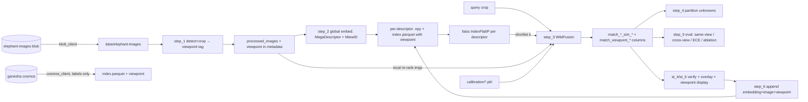

# Elephant Re-ID — Detailed Codebase Change Design

> Companion to [elephant_adaptation_plan.md](elephant_adaptation_plan.md). That doc is
> the *what/why/phasing*; this doc is the *how the code changes*, file by file.
> Target repo: private, under `github.com/rmdodhia` (seeded from this code).

---

## 0. The core transformation

Every giraffe-specific assumption and its replacement:

| # | Giraffe assumption | Where it lives today | Elephant replacement |
| --- | --- | --- | --- |
| 1 | Identity = **torso coat pattern**; crop the torso | `step_1`, `Giraffe_seg_and_torso_seg_process`, `ProcessGiraffe` | Identity spread across **ears, head, trunk, tusks, body, tail**; crop the **whole animal** (MegaDetector) so all are retained; emit a `viewpoint` tag from crop geometry |
| 2 | Representation = **SIFT** local descriptors (N×128 per image) | `step_2`, `cv2.SIFT_create` | **Global deep descriptor(s)** — MegaDescriptor-L-384 (1536-d) and MiewID-msv3 (2152-d) simultaneously; one row per image per descriptor |
| 3 | Match = **FAISS NN + mode voting** over SIFT, L2 distance | `step_3`, `utils_matching` | **Cosine shortlist → LightGlue/LoFTR re-rank → calibrated fusion** |
| 4 | Score semantics = **distance (lower better)** + vote count | configs, `step_3/4/5` | **Similarity (higher better)** in [0,1] after calibration |
| 5 | IDs are **integers** (`AID2021`, `#Serial`), new id = `max+1` | `helpers_matching`, `step_4/6` | **String IDs** (`individual_id="eleph_kunene"`, `image_id=uuid`) |
| 6 | Per-image data = **variable-length dict pickles** | `*.pkl`, `load_pkl_files` | **Fixed-width `.npy` matrix + parquet index** |
| 7 | No viewpoint metadata | — | **`viewpoint` column** (`left`/`right`/`frontal`/`rear`/`unknown`) in schema from Phase 1 |

---

## 1. Target repo layout

```
configs/
  config_vision.py        # ~replaced: detector cfg, drop detectron2 model paths
  config_matching.py      # heavy edit: embedding/matcher/fusion/calibration params
  config_elephant.py      # NEW: species profile (id cols, model ids, thresholds, viewpoint values)
models/                   # NEW package (the WildFusion building blocks)
  __init__.py
  detector.py             # NEW: ElephantDetector (MegaDetector / pass-through) + viewpoint tagger
  embedder.py             # NEW: GlobalEmbedder (MegaDescriptor and/or MiewID; pluggable)
  local_matcher.py        # NEW: LocalMatcher (LightGlue/LoFTR via kornia)
  calibration.py          # NEW: Calibrator (isotonic with temperature-scaling fallback)
  fusion.py               # NEW: WildFusionMatcher (shortlist + re-rank + fuse)
azure/                    # NEW package (Ganesha access)
  __init__.py
  blob_client.py          # NEW: pull images from elephant-images (Entra ID)
  cosmos_client.py        # NEW: read labels/metadata from ganesha (read-only)
pipeline/
  step_1_run_detection_to_crop.py      # RENAME of step_1_*crop_torso.py, rewritten
  step_2_create_embeddings.py          # RENAME of step_2_create_image_discriptors.py, rewritten
  step_3_run_initial_matching.py       # rewritten matcher internals
  step_4_partition_new_items.py        # adapted to similarity + string ids
  step_5_evaluate_matching_results.py  # add top-k / mAP / calibration metrics + viewpoint breakdown
  step_6_update_database.py            # append embeddings + images, string ids, viewpoint
  step_2b_extract_local_features.py    # NEW (optional): cache local keypoints
utils/
  utils_matching.py       # remove giraffe seg/SIFT classes; repurpose faiss for global vecs
  helpers_matching.py     # embeddings IO; string-id new-individual logic; LOIO split helpers
  utils_sharding.py       # keep (frequency sharding by individual_id) — minor
  utils_embeddings.py     # NEW: npy+parquet read/write, normalization, sanity checks
st_pages/                 # rebrand; add match-overlay visualization; new schema columns incl. viewpoint
object_detection/         # giraffe detectron2 trainer/predictor — REMOVE or archive
requirements.txt / environment.yaml    # modernized (see §7)
```

Removed: `object_detection/` (detectron2 giraffe torso trainer), the
`Giraffe_seg_and_torso_seg_process` + `ProcessGiraffe` classes, all SIFT code paths.

---

## 2. Data-artifact redesign

**Today** (per partition `reference` / `query`):
- `giraffes_<partition>_descriptors.pkl`
  - reference: `{ AID2021:int -> ([Nx128 float32, ...], [#Serial:int, ...]) }`
  - query: `{ img_filename:str -> Nx128 float32 }`
- FAISS: `IndexHNSWFlat(128,16)` over **all stacked SIFT rows** + parallel
  `all_labels_train`, `all_serials_train` (one entry **per descriptor row**).

**New** (per partition, **per global descriptor** `<desc>` ∈ {megadescriptor, miewid}):
- `embeddings/<partition>_<desc>.npy` — `float32 (n_images, D)`, **L2-normalized**
  (D=1536 for MegaDescriptor-L-384, 2152 for MiewID-msv3).
- `embeddings/<partition>_index.parquet` — one row **per image** (shared across descriptors):
  `image_id, path_relative_to_root, individual_id, viewpoint, <desc>_row…, crop_path, partition`
  (+ joined metadata: name, seek_id, herd, markings…).
  The `viewpoint` column is populated from Phase 1 onward; initial value is `"unknown"`.
- `faiss_index/<desc>.index` — one `IndexFlatIP` **per descriptor** (inner product = cosine
  on normalized vectors). Flat is ample for ~10³ images; HNSW only if the catalog grows large.
- `local_features/<image_id>.pt` *(optional cache)* — keypoints/descriptors for the
  local matcher, so re-ranking doesn't recompute per query.
- `calibration/<matcher>.pkl` — fitted calibrators (isotonic or temperature-scaling).

Net effect: `serialize_a_reference_image_data`, `reshape_reference_data_for_faiss`,
`serialize_and_reshape_a_query_image_data` (all SIFT-row fan-out helpers) are **deleted**;
one image now maps to exactly one vector/row per descriptor.

---

## 3. Metadata schema migration

`load_metadata_file` keeps `path_relative_to_root` as the required key but the identity
columns change. New-individual ID math (`get_new_label_Id`/`get_new_serial_Id` doing
`int(max)+1`) is **replaced** because elephant IDs are strings.

| Giraffe column | Elephant column | Type | Notes |
| --- | --- | --- | --- |
| `AID2021` | `individual_id` | str | `eleph_kunene`; new = `eleph_unk_<uuid8>` |
| `#Serial` | `image_id` | str | image uuid (already in blob filenames) |
| — (new) | `viewpoint` | str | `left`/`right`/`frontal`/`rear`/`unknown`; populated Phase 1/5 |
| `descriptors_size` | `embedding_row` | int | row index into `<partition>_<desc>.npy` |
| `matching_mean_dist_{1..3}` | `match_global_sim_{1..3}` | float | cosine, higher=better |
| `matching_mode_{1..3}` | `match_local_count_{1..3}` | int | verified correspondences |
| — (new) | `match_fused_sim_{1..3}` | float | calibrated fused score [0,1] |
| `matched_label_{1..3}` | `match_individual_{1..3}` | str | candidate individual_id |
| `matched_img_serial_{1..3}` | `match_image_{1..3}` | str | candidate image_id |
| — (new) | `match_viewpoint_{1..3}` | str | viewpoint of the candidate image |
| `matching_status` | `matching_status` | str | `matched` / `not_matched` (kept) |
| `new_id_aligned_with_ref` | `assigned_individual_id` | str | kept role, string-valued |
| `human_input` | `human_input` | str | `AcceptId`/`AssignNewId` (kept) |

A tiny `configs/config_elephant.py` centralizes these so the framework stays
species-agnostic:

```python
ID_COL          = "individual_id"
IMAGE_ID_COL    = "image_id"
VIEWPOINT_COL   = "viewpoint"
VIEWPOINT_VALUES = ["left", "right", "frontal", "rear", "unknown"]

# Pluggable global descriptors — fused at score level (use one or several)
GLOBAL_DESCRIPTORS = {
    "megadescriptor": {"model_id": "BVRA/MegaDescriptor-L-384",    "dim": 1536, "input_size": 384},
    "miewid":         {"model_id": "conservationxlabs/miewid-msv3", "dim": 2152, "input_size": 440},
}
ACTIVE_DESCRIPTORS = ["megadescriptor", "miewid"]  # ablation decides the final set

NEW_ID_PREFIX   = "eleph_unk_"

# Calibration
CALIBRATION_METHOD = "isotonic"   # "isotonic" | "temperature"  — see calibration.py
MIN_POSITIVE_PAIRS_FOR_ISOTONIC = 200  # fall back to temperature scaling below this
```

---

## 4. New modules (signatures)

### `models/embedder.py`
```python
class GlobalEmbedder:                    # one instance per descriptor backend
    def __init__(self, backend="megadescriptor", device="cuda"): ...  # backend ∈ {megadescriptor, miewid}
    def embed(self, image_bgr: np.ndarray) -> np.ndarray:        # (D,) float32, L2-normalized
    def embed_batch(self, images: list[np.ndarray]) -> np.ndarray  # (B, D)
```
Pluggable global descriptor. Backends:
- **MegaDescriptor** (`BVRA/MegaDescriptor-L-384`, Swin-L, 1536-d) via the `wildlife-tools`
  extractor — the WildFusion-native descriptor, trained on 30+ wildlife datasets.
- **MiewID-msv3** (`conservationxlabs/miewid-msv3`, 2152-d) via
  `transformers.AutoModel.from_pretrained(..., trust_remote_code=True)` — Wild Me's production model.

Both run on GPU and return L2-normalized vectors. Recomputing here is the
**provenance-controlled** replacement for the unverified Cosmos vectors. Multiple backends
can be instantiated and fused (see `fusion.py`).

### `models/local_matcher.py`
```python
class LocalMatcher:
    def __init__(self, backend="lightglue", max_keypoints=2048, min_matches=15): ...
    def score(self, query_bgr, ref_bgr) -> tuple[float, dict]:   # (#geom-verified matches, viz payload)
    def score_against(self, query_bgr, ref_bgrs: list) -> list[float]
```
LightGlue(+SuperPoint/ALIKED) or `kornia.feature.LoFTR`; RANSAC geometric verification;
similarity = number of inliers. The `viz payload` feeds the UI keypoint overlay.

### `models/calibration.py`
```python
class Calibrator:                       # one per matcher (global, local)
    def fit(self, scores: np.ndarray, is_same: np.ndarray,
            n_positive_pairs: int) -> "Calibrator":
        # selects method automatically: isotonic if n_positive_pairs >= MIN_POSITIVE_PAIRS_FOR_ISOTONIC,
        # else temperature scaling; logs the choice
    def transform(self, scores: np.ndarray) -> np.ndarray   # -> [0,1], monotone by construction
    def save(self, path) / load(path)
    @property
    def method(self) -> str  # "isotonic" | "temperature"
```

**Isotonic regression** is the WildFusion default and works well when there are enough
positive pairs to constrain the fit. **Temperature scaling** fits a single scalar `T` by
minimizing log-loss on the calibration set: `p = sigmoid(score / T)`. It is lower-variance,
monotone by construction, and interpretable — the right fallback for 34 individuals where
positive pairs are scarce. The `Calibrator` selects automatically based on
`MIN_POSITIVE_PAIRS_FOR_ISOTONIC`; the chosen method is logged so it's auditable.

The calibration set is always a **leave-one-individual-out (LOIO)** cross-validation
result — never the same split used for threshold tuning. See §5 (`step_5`) for the split
generation logic.

### `models/fusion.py` — the WildFusion orchestrator
```python
class WildFusionMatcher:
    def __init__(self, embedders: dict, local_matcher, calibrators: dict,
                 faiss_indexes: dict, index_df, shortlist_k=50, weights: dict = None): ...
    #   embedders / faiss_indexes / calibrators are keyed by matcher name:
    #   {"megadescriptor", "miewid", "local"} — any subset
    def shortlist(self, query_imgs) -> list[candidate]     # union of per-descriptor FAISS top-k
    def rerank(self, query_bgr, candidates) -> list[scored]# local matcher on the shortlist
    def fuse(self, sims: dict) -> float                    # Σ wᵢ · calibratedᵢ(simᵢ)
    def identify(self, query_bgr) -> list[Recommendation]  # top-N (individual, image, per-matcher sims, viz)
```
Score-level fusion ⇒ each global descriptor (MegaDescriptor, MiewID) and the local matcher
is an independent, calibrated member; the global ones shortlist, the local one re-ranks.
Mirrors `wildlife_tools.similarity.wildfusion.WildFusion` + `SimilarityPipeline`; we wrap it
so the pipeline/UI keep a stable interface.

### `models/detector.py`
```python
class ElephantDetector:
    def __init__(self, backend="megadetector", conf=0.5): ...
    def crop(self, image_bgr) -> tuple[np.ndarray | None, str]:
        # returns (cropped_image, viewpoint_tag)
        # viewpoint_tag ∈ {"left", "right", "frontal", "rear", "unknown"}
```
**Crop = the whole animal**, not a single body part. A side/lateral bbox keeps the ear,
head, trunk, a tusk, the spine/back, and the tail; a frontal bbox keeps both ears, the
face, trunk and both tusks. We deliberately retain all of these because elephant identity
is distributed across them — the Kariega catalog markings themselves reference ear
notches/tears/holes *and* tusk asymmetry *and* spine bumps *and* tail hair/kinks.

The detector also emits a **viewpoint tag** from bbox aspect ratio and image geometry
(landscape narrow bbox → `left` or `right`; wide short bbox → `frontal`; posterior
aspect → `rear`; ambiguous → `unknown`). This is a heuristic tagger sufficient for
Phase 5 — a proper pose classifier can replace it later if cross-view accuracy remains low.

MegaDetector via `PytorchWildlife` (whole-animal detector), or pass-through
(`crop = identity`) for already-tight catalog crops.

### `azure/blob_client.py` / `azure/cosmos_client.py`
```python
class ElephantBlobClient:
    def __init__(self, account="ganeshasfc2o4rujo76u", container="elephant-images"): ...
    def download(self, blob_path, dest) ; def sync_prefix(self, prefix, dest_dir)
class GaneshaCosmosClient:               # read-only
    def __init__(self, endpoint, database="ganesha"): ...
    def fetch_individuals(self) -> pd.DataFrame          # labels/markings/seek_id/GPS, NOT vectors
```
Both use `azure.identity.DefaultAzureCredential` (Entra ID, Ganesha tenant).

---

## 5. Per-file change detail (pipeline + utils)

### `pipeline/step_1_run_detection_to_crop.py` (was `…crop_torso.py`)
- Delete `load_computer_vision_models` (detectron2 seg + torso predictors).
- `run_vision(...)` → `run_detection(...)`: loop images → `ElephantDetector.crop` →
  save crop to `processed_images/`; **write `viewpoint` tag to metadata CSV alongside
  crop path**. No segmentation/torso geometry.
- Drop imports of `ProcessGiraffe`, `cropped_img_size`-as-SIFT-size (keep as detector/embed
  input size).

### `pipeline/step_2_create_embeddings.py` (was `…create_image_discriptors.py`)
- Replace `get_sift_discriptor_based_on_saved_images_labels_{known,NOT_known}` with
  `get_embeddings(partition, metadata, crop_dir)`:
  - for each active descriptor, load each crop → `GlobalEmbedder.embed_batch` (batched on
    GPU) → stack to `(n,D)` → write `<partition>_<desc>.npy`; write the shared
    `<partition>_index.parquet` (includes `viewpoint` column from metadata).
  - reference & query now share the **same** function (labels are just a column, not a
    different data structure).
- Delete `update_descriptor_dict_labels_{known,NOT_known}`, the `cv2.SIFT_create` calls,
  pickle writers, and `run_a_check_on_{reference,query}_data`.

### `pipeline/step_3_run_initial_matching.py`
- Replace `inference_per_query_for_re_identification` (FAISS NN + `serial_scores_mapping`
  mode voting + `faiss_mode_cutoff_re_id`) with:
  ```python
  recs = wildfusion.identify(query_bgr)          # shortlist→rerank→fuse
  fill_matching_results(query_metadata, recs)    # writes match_*_sim_*, match_individual_*, etc.
  status = "matched" if recs[0].fused_sim >= MATCH_ACCEPT_THRESHOLD else "not_matched"
  ```
- `train_faiss` call switches to building one `IndexFlatIP` **per descriptor** over its
  per-image embedding matrix (one add of `(n,D)` each), not stacked SIFT rows. Sharding
  (`utils_sharding`) still applies by `individual_id` for very large catalogs but is optional.
- `fill_matching_results` stays structurally; only the column names/value sources change
  (includes `match_viewpoint_{1..3}` from candidate metadata).

### `pipeline/step_4_partition_new_items.py`
- `build_faiss_index` / `run_partitioning_algorithm`: keep the union-find clustering of
  unmatched queries (`run_union_find`, `replace_negatives_with_unique_values`) but feed it
  **fused similarity** edges (threshold on calibrated score) instead of SIFT vote counts.
- `re_assign_ids_to_align_with_ref_db` + `get_new_label_Id`: replace integer `max+1`
  scheme with `NEW_ID_PREFIX + uuid8`; drop the `+20000000` inference-mode hack (string ids
  don't collide).
- `get_serial_to_aid_dict` keys on `image_id`/`individual_id`.

### `pipeline/step_5_evaluate_matching_results.py`
- Keep the confusion-matrix logic (`find_query_out_of_sample_records`,
  `evaluate_accuracy_high_level`) — it's threshold-driven and species-agnostic.
- Add: top-1/top-5 accuracy, mAP, and **calibration error (ECE)** on the fused score.
- Add: **ablation harness** (global-only vs +local vs fusion) writing a comparison CSV.
- Add: **same-view vs cross-view accuracy breakdown** — group probe/gallery pairs by
  whether their `viewpoint` tags match; report accuracy separately for each group.
  If cross-view accuracy is below ~70%, escalate viewpoint-aware matching as a priority.
- Add: **LOIO split generation** for calibration evaluation:
  ```python
  def loio_splits(metadata_df, id_col):
      for held_out_id in metadata_df[id_col].unique():
          train = metadata_df[metadata_df[id_col] != held_out_id]
          probe = metadata_df[metadata_df[id_col] == held_out_id]
          yield train, probe
  ```
  The calibration fitted on each LOIO fold must not use the probe fold's scores.
  Also enforce **same-session leakage guard**: if a `session_date` or `occasion_id` column
  is present, ensure no probe image shares a session with any gallery image.
- `out_of_sample` / `matching_status` comparisons now use string `individual_id`.

### `pipeline/step_6_update_database.py`
- `update_original_ref_db`: instead of appending SIFT arrays to the reference dict, append
  the query image's embedding **row** to each `reference_<desc>.npy`, add its parquet row
  (including `viewpoint`), and copy the crop into the reference image store;
  rebuild/extend each `<desc>.index`.
- ID/serial casts (`astype(int)`) removed; use string ids.

### `utils/utils_matching.py`
- **Remove**: `Giraffe_seg_and_torso_seg_process`, `ProcessGiraffe`,
  `save_cropped_torso_image`, `serialize_*`/`reshape_*_for_faiss` (SIFT fan-out).
- **Repurpose**: `train_faiss`→`build_global_index(embeddings)` using `IndexFlatIP`;
  `normalize` kept (already L2). `read_faiss`/`write_faiss`/`load_trained_faiss_ref` keep
  the same on-disk contract but store the embedding matrix + parquet instead of SIFT pkls.
- Keep `run_union_find`, `replace_negatives_with_unique_values` (clustering primitives).

### `utils/helpers_matching.py`
- `load_pkl_files` → `load_embeddings(root_dir, partitions, descriptors)` returning
  `{partition: {desc: np.ndarray(n,D)}}` plus the shared `index_df`.
- `get_new_label_Id`/`get_new_serial_Id` → `mint_new_individual_id()` (uuid-based).
- `load_metadata_file` schema check: require `path_relative_to_root` and `viewpoint`;
  warn on missing `individual_id`. `formatted_string_for_setup` rebuilt from similarity
  thresholds.
- Add `make_loio_splits(metadata_df, id_col, session_col=None)` — generates
  train/probe index pairs for leave-one-individual-out calibration, with optional
  same-session guard.

### `utils/utils_embeddings.py` (NEW)
`save_embeddings`, `load_embeddings`, `l2_normalize`, `cosine_topk`,
`sanity_check_against_cosmos(recomputed, cosmos_vecs)` (the provenance check from the plan).

---

## 6. Streamlit UI (`st_pages/`)
- Global rebrand giraffe→elephant (copy, `infographic/*`, `static/templates/header.html`,
  `README_UI.md`); `demo_images` swapped.
- `st_2` (preprocess): "torso crop" → "elephant detection/crop"; display the detected
  `viewpoint` tag alongside each crop thumbnail.
- `st_3` (re-identification): runs `step_3` (unchanged invocation via `setup_pipeline.sh`);
  copy now describes embedding + local-feature fusion rather than SIFT/Euclidean.
- `st_4` / `st_6` (verify): **new keypoint-match overlay** — render the `LocalMatcher` viz
  payload (query↔candidate correspondences) beside the fused/global/local scores. Also
  display `viewpoint` tag for both query and candidate so the expert can weigh cross-view
  matches appropriately. This is the biggest UI addition and the main expert-in-the-loop win.
- All pages: switch displayed columns to the new schema (§3); include `viewpoint` where
  relevant.
- `pycode_name` references updated for renamed `step_1`/`step_2`.

---

## 7. Dependency diff (`requirements.txt` / `environment.yaml`)

> **Validate this diff on the V100 before writing code.** Run `pip install` with the
> additions below and verify `import torch; import wildlife_tools; import kornia;
> import lightglue` all succeed. If `wildlife-tools` creates a conflict (it is fast-moving
> and may pin specific kornia/lightglue versions), drop it as a top-level dependency and
> import `pymiew` + `kornia.feature.LoFTR` + `lightglue` directly. Record the resolved
> versions in `requirements.txt` with exact pins.

```diff
- torch==1.10.1+cu111
- torchvision==0.11.2+cu111
- detectron2==0.6+cu111
- faiss-cpu==1.8.0.post1
+ torch>=2.2            # upstream already has dependabot/pip/torch-2.8.0
+ torchvision (matched)
+ timm                 # Swin backbone for MegaDescriptor / MiewID
+ huggingface_hub
+ wildlife-tools       # MegaDescriptor + MiewID extractors, LoFTR/LightGlue matchers, WildFusion + calibration
+ kornia               # LoFTR / LightGlue ops
+ lightglue            # (if not pulled via kornia)
+ faiss-gpu            # or keep faiss-cpu (catalog is small)
+ azure-cosmos         # Ganesha metadata (read-only)
+ azure-storage-blob   # elephant-images sync
  azure-identity (kept), azure-keyvault-secrets (kept), msal (kept), streamlit (kept)
```
`detectron2` is dropped because it pins torch 1.10 and blocks the modern stack; nothing in
the elephant path needs it. If a giraffe detector must be retained, isolate it in a
separate environment — do not co-install.

---

## 8. New end-to-end data flow



---

## 9. Sequencing (maps to plan phases)

0. **Dependency validation** — `pip install` the new stack on V100; record exact versions.
   Blocking for everything below.
1. `azure/` + `utils_embeddings.py` + `config_elephant.py` (data in, schema fixed,
   **`viewpoint` column defined**).
2. `models/embedder.py` + `step_2` (embeddings for both descriptors; run Cosmos sanity check).
3. `models/fusion.py` global path + `step_3` shortlist (baseline to beat); evaluate by viewpoint.
4. `models/local_matcher.py` + `calibration.py` (LOIO + auto method selection) + fusion (full WildFusion).
5. `models/detector.py` + `step_1` (populate `viewpoint` tags from detector geometry).
6. `st_pages/` overlay + rebrand + viewpoint display.
7. `step_5` metrics (same-view/cross-view, ECE, LOIO calibration eval) + threshold tuning.

Each step is independently testable (see plan §8). Nothing here is pushed to the public
giraffe remote.
